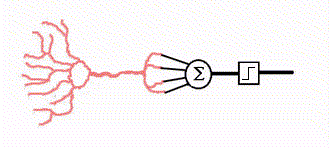

# Neuronio
A definição formal diz que: 
>"É a célula do sistema nervoso responsável pela condução do impulso nervoso, é constituído de corpo celular, núcleo celular, dendritos, axônio e telodendritos"

Tá aqui o bicho

Pensando de forma sistemica esse cara ele ficaria mais ou menos assim:

<!-- [Neuronio artificial](assets/images/tikz9.png) -->

Beleza ?

 Os valores x1, x2, x3, ... são os valores de entrada para esse neuronio, 
 esses valores são multiplicados pelos seus respectivos pesos e somados juntamente com a constante bias.

 Como eu gosto de imagem vamos ver isso graficamente:

 

#####Se x1, x2, xn são os valores do meu problema quem são w1, w2, wn ?

W é o peso para cada valor, inicialmente você pode associar randomicamente um valor para eles, porque depois a rede vai aprender e vai convergir esses valores adequadamente.

#####E quem é esse tal de "bias" ?

O Bias pode ser considerado como uma nova entrada para o neuronio, ele faz com que a saida do neuronio seja diferente de zero mesmo qeu todas as entradas do mesmo seja nula. Como ele pode ser considerado como mais uma entrada do neuronio ele também é ajustado conforme a rede aprende.

####Resumo de tudo o que aprendemos:

Essa é nossa função de ativação:

------

Função de transferência (T)

O perceptron é bem legal, mas com ele só conseguimos fazer separações lineares o que nos leva a pensar no problema do ou exclusivo ou popularmente conhecido na nossa área como XOR.

Vamos relembrar a tablea XOR para a &oplus; b:

| a	| b | a&oplus;b	|
|---|---|---|
| 0	| 0	| 0	|
| 0	| 1	| 1	|
| 1	| 0	| 1	|
| 1	| 1	| 0	|

Rapidamente observamos uma padrão, quando as entradas forem iguais o resultado é zero (0) caso existe pelo menos uma entrada diferente o resultado será um (1).

Tá mas porque o perceptron não consegue resolver esse tipo de problema ?

Vamos desenhar....

OR:

	Será verdade se pelo menos um item for verdadeiros.

AND:

	Será verdade se todos os valores forem verdadeiros.

XOR:

	Será verdade se pelo menos um item for diferente.

Sendo assim conseguimos facilmente observar a reta no plano cartesiano que separa os grupos OR e AND, mas uma reta somente não consegue separar o grupo XOR, então nesse caso seriam necessário duas retas, como podemos observar abaixo:

Qual foi a lição aprendida hoje amiguinhos ?

	Redes de uma única camada conseguem resolver problemas lineares.

Beleza mas e agora, como resolvemos esse tipo de problema não linear ?

#### MLP (Multi Layer Perceptron)

Onde:

1 e 2 é a primeira camada

3 é a camada de saida

Ou seja, nessa rede temos 3 neuronios e 2 camadas, a ilustração acima mostra bem como a rede soluciona o problema do XOR.

