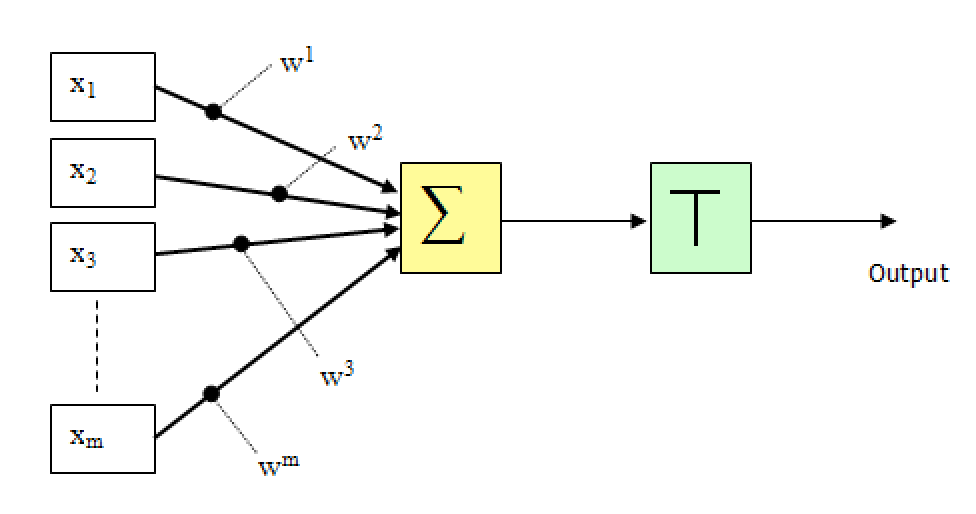
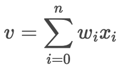
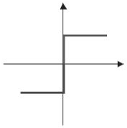
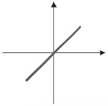
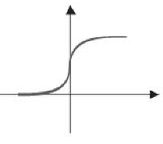
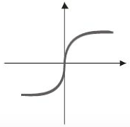
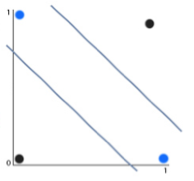
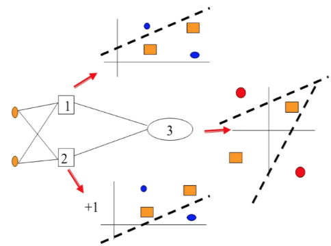

# Neurônio
A definição formal diz que: 
>"É a célula do sistema nervoso responsável pela condução do impulso nervoso. É constituído de corpo celular, núcleo celular, dendritos, axônio e terminações (telodendritos)"

Tá aqui nosso amigo:

O neurônio artificial é uma abordagem simplificada do neurônio real (biológico), sendo assim, se vamos simplificá-lo, perceba que meu neurônio artificial possui praticamente a mesma estrutura do neurônio biológico. No meu núcleo temos a função agregadora **( &sum; )** que representa o somatório de todas as entradas multiplicadas pelos seus pesos (soma dos produtos), e **( T )** que é nessa função de ativação ou também conhecida como função de transferência, basicamente essa função que vai definir se meu sinal vai se propagar ou vai ser inibido ou até mesmo alterado:

<!-- [Neuronio artificial](assets/images/tikz9.png) -->

<!-- [Bio + Artificial](assets/images/neuron-bio-with-artificial.gif) -->

Beleza?

 Os valores x1, x2, x3, ... são os valores de entrada para esse neurônio.
 Esses valores são multiplicados pelos seus respectivos pesos e somados juntamente com a constante bias.

 Como eu gosto de imagem vamos ver isso graficamente:

 

#####Se x1, x2, xn são os valores do meu problema quem são w1, w2, wn ?

W é o peso para cada valor, inicialmente você pode associar randomicamente um valor para eles, porque depois a rede vai aprender e vai convergir esses valores adequadamente. Esse é o grande objetivo da rede neural "ajustar os pesos" porque depois que eles estiverem ajustados podemos testar a rede.

#####E quem é esse tal de "bias" ?

O Bias pode ser considerado como uma nova entrada para o neurônio. Ele faz com que a saída do neurônio seja diferente de zero, mesmo qeu todas as entradas do mesmo, seja nula. Como ele pode ser considerado como mais uma entrada do neurônio, ele também é ajustado conforme a rede aprende.

##### Podemos resumi tudo que aprendemos até agora somente com essa fórmula de nossa função agregadora:

### Função de ativação(T)

Existem várias funções de ativação, entre as principais são:

	

- Degrau ou degrau bipolar

	

	Onde:

		F(sum) = 1  se => sum >= 1
		F(sum) = 0  se => sum = 0
		F(sum) = -1 se => sum < 0

---

- Linear

	

	Onde:

		F(sum) = sum

---

- Sigmoid

	

	Onde:

		F(sum) = 1 / (1 + e ^ (-sum))

---

- Tangente Hiperbólica

	

	Onde:

		F(sum) = ( 1 - e ^ ( b * u ) ) / ( 1 + e ^ ( b * u ) )
		

---

ps:
	
- e = [Número de euler] (https://pt.wikipedia.org/wiki/Número_de_Euler)
- ^ = exponencial

#### Vamos por o Neurônio pra funcionar

//Todo:

Escrever sobre um rede perceptron resolvendo um problema linear

---
#### Calma....
O perceptron é bem legal, mas com ele só conseguimos fazer separações lineares, o que nos leva a pensar no problema do exclusivo ou popularmente conhecido na nossa área como XOR.

Vamos relembrar a tablea XOR para a &oplus; b:

| a	| b | a&oplus;b	|
|---|---|---|
| 0	| 0	| 0	|
| 0	| 1	| 1	|
| 1	| 0	| 1	|
| 1	| 1	| 0	|

Rapidamente observamos uma padrão, quando as entradas forem iguais o resultado é zero (0) caso existe pelo menos uma entrada diferente o resultado será um (1).

Tá! Mas porque o perceptron não consegue resolver esse tipo de problema ?

Vamos desenhar....

OR:

	Será verdade se pelo menos um item for verdadeiro.

AND:

	Será verdade se todos os valores forem verdadeiros.

XOR:

	Será verdade se pelo menos um item for diferente.

Sendo assim, conseguimos facilmente observar a reta no plano cartesiano que separa os grupos OR e AND, mas uma reta somente não consegue separar o grupo XOR, então nesse caso seria necessário duas retas, como podemos observar abaixo:

Qual foi a lição aprendida hoje amiguinhos?

	Redes de uma única camada conseguem resolver problemas lineares.

Beleza, mas e agora? Como resolvemos esse tipo de problema não linear?

#### MLP (Multi Layer Perceptron)

Onde:

1 e 2 é a primeira camada

3 é a camada de saída

Ou seja, nessa rede temos 3 neurônios e 2 camadas, a ilustração acima mostra bem como a rede soluciona o problema do XOR.

